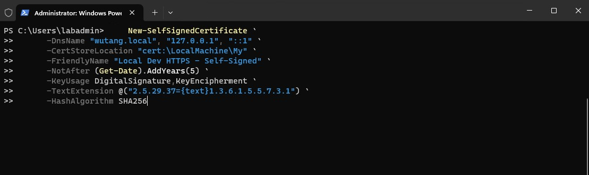
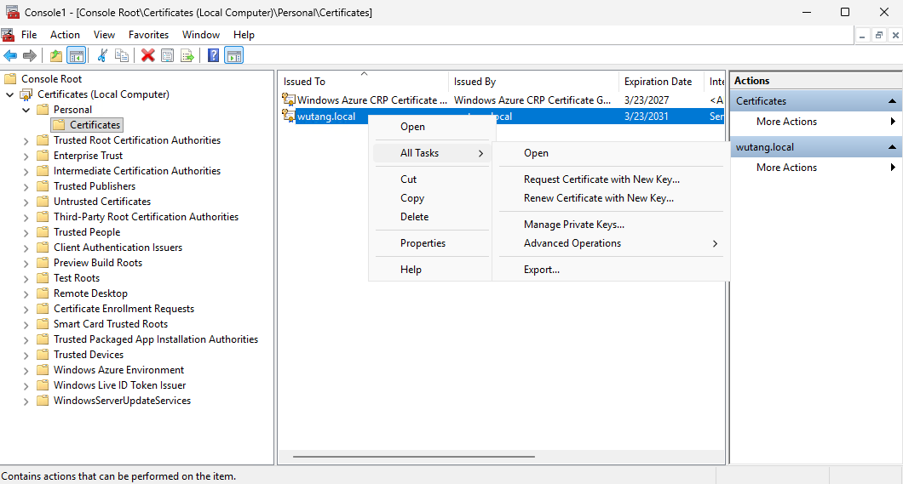

# Create a self-signed certificate with PowerShell

This lab shows how to create, inspect, export, trust, and remove a self-signed TLS certificate on Windows.

> [!WARNING]
> Use this process only for local development or an isolated lab. A self-signed certificate is not publicly trusted, and importing it into a trusted root store makes your computer trust that certificate. Production services should use certificates issued through an appropriate public or organizational certificate authority. Never share or commit a private key.

## Prerequisites

- Windows 10, Windows 11, or Windows Server 2016+
- Windows PowerShell 5.1 or PowerShell 7
- An elevated PowerShell session
- Basic familiarity with TLS certificates

## 1. Create the certificate

Open PowerShell as Administrator and run:

```powershell
$certificate = New-SelfSignedCertificate `
    -DnsName "localhost", "127.0.0.1", "::1" `
    -CertStoreLocation "Cert:\LocalMachine\My" `
    -FriendlyName "Local Dev HTTPS - Self-Signed" `
    -NotAfter (Get-Date).AddYears(1) `
    -KeyUsage DigitalSignature, KeyEncipherment `
    -TextExtension @("2.5.29.37={text}1.3.6.1.5.5.7.3.1") `
    -HashAlgorithm SHA256

$certificate | Format-List Subject, Thumbprint, NotBefore, NotAfter
```

The DNS names become Subject Alternative Names (SANs). Replace them with the exact development hostnames you will use. The Server Authentication extended key usage identifies the certificate as suitable for TLS server authentication.



## 2. Inspect the certificate

Use PowerShell:

```powershell
Get-ChildItem Cert:\LocalMachine\My |
    Where-Object FriendlyName -eq "Local Dev HTTPS - Self-Signed" |
    Format-List Subject, Thumbprint, NotAfter, HasPrivateKey
```

Or open the Local Computer certificate manager:

```powershell
certlm.msc
```


## 3. Export the public certificate

Export only the public certificate. This `.cer` file does not contain the private key.

```powershell
$certificate = Get-ChildItem Cert:\LocalMachine\My |
    Where-Object FriendlyName -eq "Local Dev HTTPS - Self-Signed" |
    Select-Object -First 1

if (-not $certificate) {
    throw "The lab certificate was not found."
}

Export-Certificate `
    -Cert $certificate `
    -FilePath "$env:TEMP\localhost-lab.cer"
```

## 4. Trust it on this lab computer

Importing the public certificate into the Local Computer trusted root store removes trust warnings for names included in the certificate, but only on this computer.

```powershell
Import-Certificate `
    -FilePath "$env:TEMP\localhost-lab.cer" `
    -CertStoreLocation "Cert:\LocalMachine\Root"
```

You can also double-click the `.cer` file, choose **Local Machine**, and place it in **Trusted Root Certification Authorities**.




## 5. Remove the lab certificate

Remove the certificate from both stores when the lab is complete. Verify the displayed certificates before confirming the removal.

```powershell
$friendlyName = "Local Dev HTTPS - Self-Signed"

Get-ChildItem Cert:\LocalMachine\My, Cert:\LocalMachine\Root |
    Where-Object FriendlyName -eq $friendlyName |
    Format-Table Subject, Thumbprint, PSParentPath

# After checking the list above, uncomment the next command:
# Get-ChildItem Cert:\LocalMachine\My, Cert:\LocalMachine\Root |
#     Where-Object FriendlyName -eq $friendlyName |
#     Remove-Item
```

## Troubleshooting

- Restart the browser completely after changing certificate trust.
- Ensure the URL hostname exactly matches one of the certificate's SANs.
- Firefox may use a separate certificate trust store depending on its configuration.
- If the private key is required by a service, configure that service to use the certificate from `LocalMachine\My`; do not export the key unnecessarily.
- For convenient local development across several hostnames, consider a development CA tool such as `mkcert`.

## Security notes

- A self-signed certificate can encrypt traffic, but it does not provide public identity assurance.
- Do not use a five-year lifetime for routine development certificates; shorter lifetimes reduce exposure.
- Do not commit `.pfx`, `.p12`, private-key, password, or production certificate files.
- Use a managed certificate service or approved organizational PKI in production.

## License

Licensed under the [MIT License](LICENSE).
